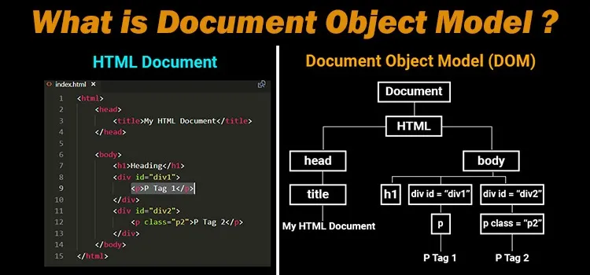

## O que é o DOM (Document Object Model)

O DOM (Document Object Model) é uma representação de dados dos objetos de uma página Web. Esses objetos são os elementos  que compõem a estrutura e conteúdo do documento.  
O DOM é uma interface de programação para os documentos HTML e XML. Ele representa a página de uma forma que os programas possam alterar a estrutura do documento, alterar o estilo e o seu conteúdo.

O DOM é um modelo que representa a hierarquia da página, mostrando todos os elementos e as suas relações. Eles são representados na forma de objetos e nós.  
O primeiro elemento do modelo é sempre a Window, que possui dentro dela o Document.

### Manipulando o DOM

O DOM não é uma linguagem de programação, mas ele é necessário para que o JavaScript tenha um modelo para trabalhar com páginas web, páginas XML e os elementos existentes nelas. Cada elemento do documento faz parte do DOM, podendo ser acessados e manipulados usando o DOM e uma linguagem de programação.

#### Operações Básicas

- **getelementsByTagName**: Retorna um array de elementos, sendo todos os elementos pelo nome da tag especificada.
- **getelementsByClassName**: Retorna um array de elementos, sendo todos os elementos pelo nome da class especificado.
- **getelementsById**: Retorna um único elemento, pelo Id especificado. O ID do elemento deve ser único na página.
- **querySelector**: Permite usar seletores, de forma similar ao CSS.