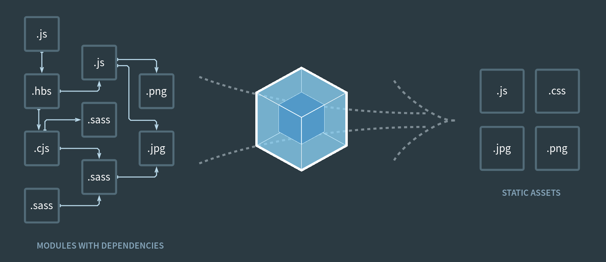

## Criando um Projeto

Ao utilizar o comando de criar um projeto React no terminal, o projeto já vem pronto com um template e diversos arquivos.  
Porém, também é importante saber como criar o projeto sem depender desse template.

### Babel

O Babel é um transpilador JavaScript de código aberto. Uma de suas principais características é converter o código JavaScript em uma versão que o navegador consiga executar.  
Ele é amplamente utilizado por desenvolvedores que precisam converter recursos do JavaScript para utilizá-los em um navegador.  
Cada navegador interpreta o código de uma maneira, e com as atualizações do JavaScript, é possível que um navegador acabe ficando incompatível com algumas das novas funcionalidades da linguagem. O Babel converte o código JavaScript para um que o navegador consiga executar.

Para configurar o Babel, primeiro é necessário ter uma pasta vazia, onde ficará o projeto. Depois utilizar o terminal para iniciar a configuração do projeto:
- Utilizar o comando `npm init -y`. O comando `-y` é utilizado para pular as perguntas de configuração iniciais.  
Isso cria o arquivo `package.json`, que contém as informações do projeto, como nome, versão, arquivo inicial, autor, licença, dentre outros.
- Instalar as dependências do Babel. Utilizar o comando `npm install @babel/core @babel/preset-env @babel/preset-react babel-loader -D`. O `-D` indica que essas dependências ficam apenas no ambiente de desenvolvimento.
    - **@babel/core** é o pacote principal do Babel.
    - **@babel/preset-env** contém os plugins necessários para trabalhar com JavaScript ES6.
    - **@babel/preset-react** é usado para trabalhar com React.
    - **babel-loader** integra o Babel com o Webpack.
- Criar o arquivo `.babelrc`, utilizado para fazer as configurações do Babel. Ele é um objeto JSON. A configuração inicial para aplicativos React é:
```
{
    "presets": [
        "@babel/preset-env",
        ["@babel/preset-react", {"runtime": "automatic"}]
    ]
}
```
- Após instalar os pacotes, eles aparecem no arquivo `package.json`.

### Webpack

O Webpack é um empacotador de módulos para JavaScript. Ele junta todos os arquivos JavaScript, HTML e CSS da aplicação em um único arquivo, de forma otimizada e organizada.  



Para configurar o Webpack, utilizar o comando `npm install webpack webpack-cli html-loader html-webpack-plugin webpack-dev-server style-loader css-loader file-loader -D`.
- `webpack`: O pacote principal do Webpack.
- `webpack-cli`: A interface de linha de comando para rodar o Webpack no terminal.
- `html-loader` `html-webpack-plugin`: Permite incluir arquivos HTML no projeto e simplifica a injeta as tags nos arquivos HTML. 
- `css-loader` `style-loader`: Permite importar arquivos CSS e injetá-los na DOM usando a tag `<style>`, assim aplicando estilos na aplicação.
- `file-loader`: Usado para lidar com arquivos como imagens, fontes, dentre outros. 
- `webpack-dev-server`: Cria um servidor de desenvolvimento com live reloading, permitindo ver as mudanças em tempo real sem recarregar a página.

Depois criar o arquivo de configuração `webpack.config.js`, com as configurações do Webpack.

### Adicionar o React na Aplicação

Para configurar o React, utilizar o comando `npm install react react-dom -D`.
- `react`: O pacote principal do React.
- `react-dom`: Ajuda a renderizar as interfaces na DOM.

Depois começar a trabalhar com o React:
- Criar uma pasta `public` que é a pasta onde o React vai atuar.
- Criar um arquivo `index.html` dentro dessa pasta. Utilizar o atalho `html:5` para criar a estrutura HTML na página.
- Criar uma `<div>` dentro do `<body>`, com um id "root". Como o React trabalha no navegador do cliente, ele trabalha dentro de um elemento da página. A `<div>` root é o elemento onde ele irá trabalhar.
- Criar uma pasta `src`, onde ficarão os arquivos da aplicação.
- Criar um arquivo `App.js`. Criar um componente dentro dele com o seguinte código:
```
const App = () => {
    return (
        <div className="App">
            <h1>Hello World!</h1>
        </div>
    )
}

export default App;
```
- Criar o arquivo `index.js`, o ponto de entrada da aplicação. Fazer os imports do React, createRoot e do componente App criado anteriormente:
```
import React from 'react';
import { createRoot } from 'react-dom/client';
import App from './App'
```
- Criar um container, pegando o elemento de id "root" dentro do App. Depois criar um root usando `createRoot`, que é o ponto inicial da aplicação, utilizando o elemento de id "root", e então renderizá-lo na tela.
```
const Container = document.getElementById("root");
const root = createRoot(Container);
root.render(App);
```

A partir disso, o aplicativo pode ser desenvolvido dentro do componente App.

### Criar um Servidor com Webpack

Abrir o `package.json` e criar uma propriedade `scripts`, para criar scripts customizados que serão executados no terminal para subir a aplicação.  
Criar dois scripts:
- `"start": "webpack serve --open --hot --mode development"`: Inicia o servidor, e toda vez que o arquivo é modificado ele é renderizado de novo.
- `"build": "webpack --mode production"`: Faz o build do projeto para preparar o deploy em produção.

Para iniciar o servidor, basta usar `npm start` no terminal.