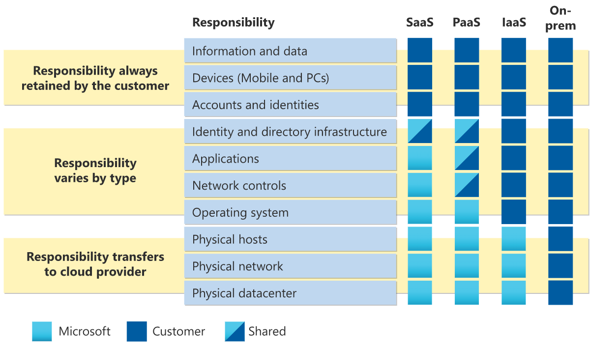

## Tipos de Serviço de Nuvem

Nos serviços de nuvem, é trabalhada a responsabilidade compartilhada, que diz que parte da responsabilidade de fornecimento do serviço é o provedor de nuvem, e outra parte da responsabilidade é da empresa que contrata o serviço.  
Nesse modelo, existem 3 tipos de serviços de nuvem, que são conceitos gerais de nuvem que estão presentes em todos os provedores.

### IaaS: Infrastructure as a Service

O modelo de Infraestrutura como Serviço é um modelo onde a infraestrutura de TI é oferecida pelo provedor de nuvem, com o aluguel de servidores, máquinas virtuais, armazenamento e redes. Nesse modelo, o provedor fornece o ambiente físico, e o cliente possui maior envolvimento com a configuração e manutenção do sistema.  
O cliente tem mais responsabilidade sobre o recurso que utiliza, tendo que determinar, na máquina virtual, qual será o backup, o modelo de acesso, as redes, o sistema operacional e muito mais configurações. Ele também precisa validar as atualizações, monitorar a execução do serviço, estar sempre presente na manutenção para garantir que o serviço está funcionando.
Porém, esse tipo de serviço permite ao cliente a maior liberdade para personalização do recurso, podendo escolher as configurações que se adequam melhor ao seu uso.

### PaaS: Platform as a Service

No modelo de Plataforma como Serviço, além de fornecer a infraestrutura física de TI, o provedor de nuvem também fornece a plataforma de desenvolvimento, incluindo o sistema operacional, as ferramentas para desenvolvedores, as ferramentas de análise de negócios e o banco de dados.  
Nesse modelo, o cliente não se preocupa com a configuração do servidor, ou com a personalização do sistema. Isso fica de total responsabilidade do provedor de nuvem, o cliente só precisa se preocupar com a aplicação. O provedor fornece o ambiente de desenvolvimento, o banco de dados e as ferramentas necessárias, e a empresa foca no desenvolvimento, teste e implantação.

### SaaS: Software as a Service

O modelo de Software como Serviço é um modelo onde o provedor de nuvem fornece uma aplicação hospedado em sua própria infraestrutura, pronto para uso pelo cliente.  
Nesse modelo, a empresa contratante é um cliente que utiliza o software, que é desenvolvido pelo próprio provedor. A empresa não desenvolve o aplicativo diretamente. Esse tipo de serviço trabalha com o acesso através de licenças, onde os clientes podem comprar uma licença para utilizar o software, e as licenças determinam o quanto do aplicativo o cliente pode visualizar, utilizar e personalizar.

### Responsabilidade Compartilhada

O modelo de responsabilidade compartilhada é um modelo que define qual parte do serviço é de responsabilidade de cada um dos envolvidos no serviço de nuvem.

A maior responsabilidade do cliente é no modelo *On premises*, onde a infraestrutura é inteiramente no local da empresa.

Na Infraestrutura como Serviço, o datacenter, a rede física e os hosts físicos são de responsabilidade do provedor.

No modelo de Plataforma como Serviço, o provedor também tem responsabilidade sobre o sistema operacional, e a responsabilidade é compartilhada entre ambos sobre os controles de rede, os aplicativos e a infraestrutura de identidade e diretório.

No modelo de Software como Serviço, somente as informações e dados, os dispositivos e as contas e identidades são de responsabilidade do cliente. A infraestrutura de identidade e diretório é compartilhada emtre ambos.

### Comparação entre os modelos

- IaaS
    - Serviço de nuvem mais flexível, permite maior gestão e personalização do hardware para o aplicativo.
    - Mais caro e requer mais recursos para gestão dos sistemas.
- PaaS
    - Focado no desenvolvimento de aplicativos. O gerenciamento da plataforma é resonsabilidade do provedor. 
- SaaS
    - Modelo de pagamento conforme o uso. Os usuários pagam apenas pelo software em um modelo de assinatura.
    - Menos controle sobre o software.